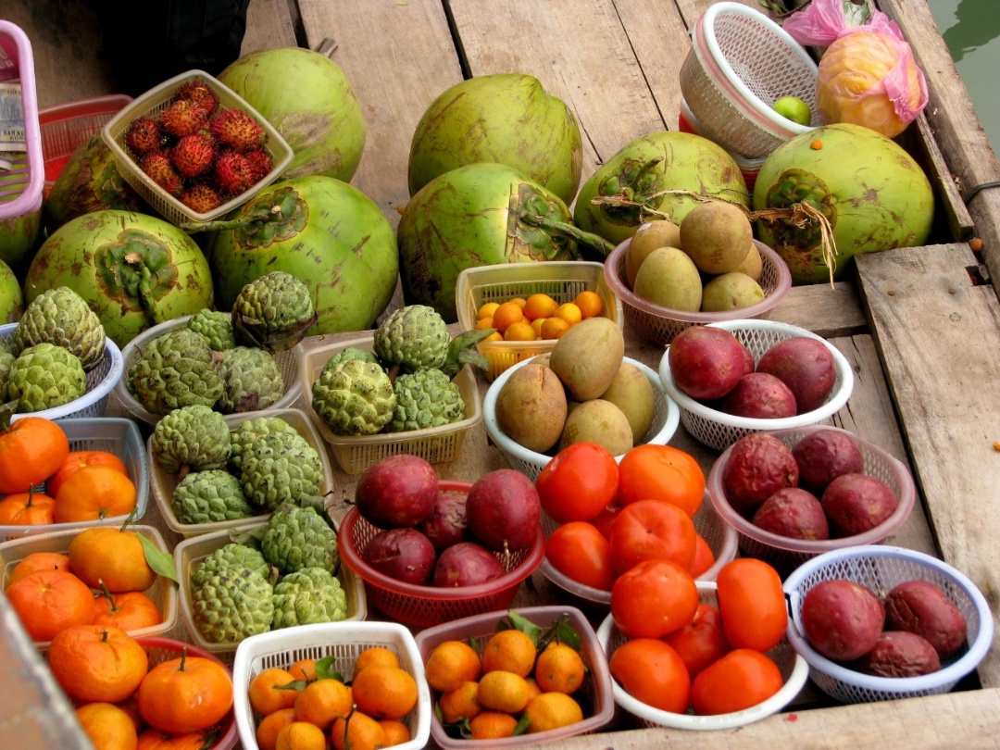
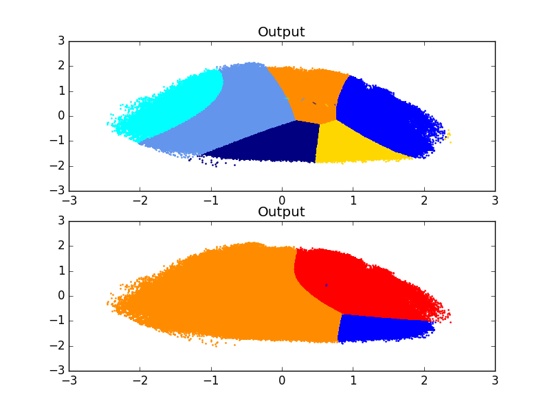
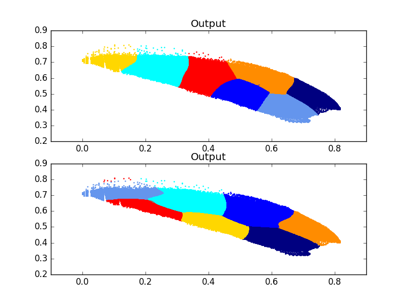
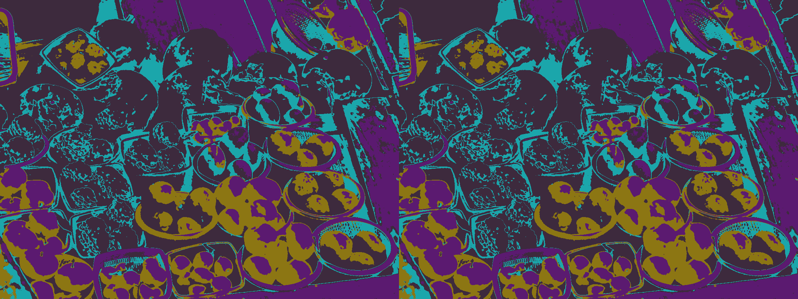
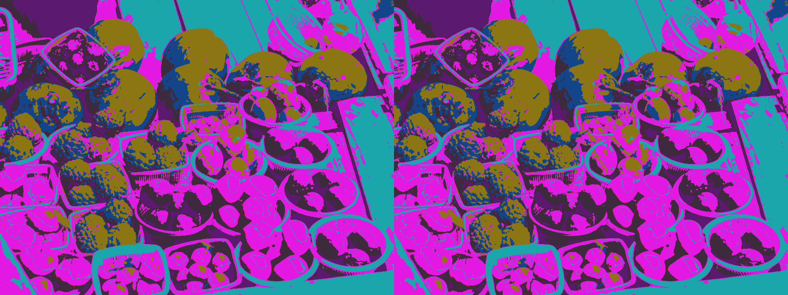

# Image-Segmentation-Using-Color-and-Texture-Descriptors-with-Expectation-Maximization
An algorithm for unsupervised segmentation of an RGB image.

Introduction :

Natural processes/systems are likely to follow gaussian distributions (or a combination of). Moreover, I have always been intrigued by unsupervised clustering methods due to the inherent statistical constraints that these methods try to capture from limited data to model the system.

Therefore, I have decided to take the approach of modelling the image data distribution as a Gaussian Mixture Model. By randomly sampling 1000 data points (pixels from the image) over 1000 iterations, we could estimate the parameters (means/labels, covariances and joint membership weights of a point belonging to each cluster). I have applied two forms of expectation maximization (initialization = kmeans & using dirichlet process prior) to derive optimum clusters and labels, with suitable hyperparameters and plot the distribution. Model building, training and testing was achieved using the Scikit-Learn API.

Example Duration for Train Step : 

Gaussian Mixture Done in 0.041s.<== ~in this range always
&
Bayesian Gaussian Mixture Done in 0.116s. <==~in this range always

Short Form Algorithm:

1. Load Image

2. Apply Gaussian Filter and Convert to CIELAB space as it better approximates human color perception

3. Capture texture information using Local Binary Patterns

4. Flatten Image to prepare data 

5. Normalise and scale data

6. Sample 1000 data points randomly and feed to estimator -> Run expectation and maximization step alternatively using these data points, using scikit GMM and DPGMM.

7. Fit model on entire Image

8. Grab output labels & assign each pixel a color corresponding to its membership class

9. Use a dictionary of BGR color codes to query pixel color based on labels.

Future Algorithm Extension:

1. Use geometric priors to constrain clustering and improve segmentation results. (Intuition = Closer Objects are More Similar in texture and color)

2. Optimise Code

Input :

Example Train/Test Image 

Results :

1. Color Data Distribution 
2. Color + Texture Data Distribution 
3. Segmentation (Only Color) 
4. Segmentation (Texture + Color) 

Conclusion:

Clearly, adding texture information enhances the segmentation results. Adding more carefully designed features that capture correlations among data samples well is highly recommended.
